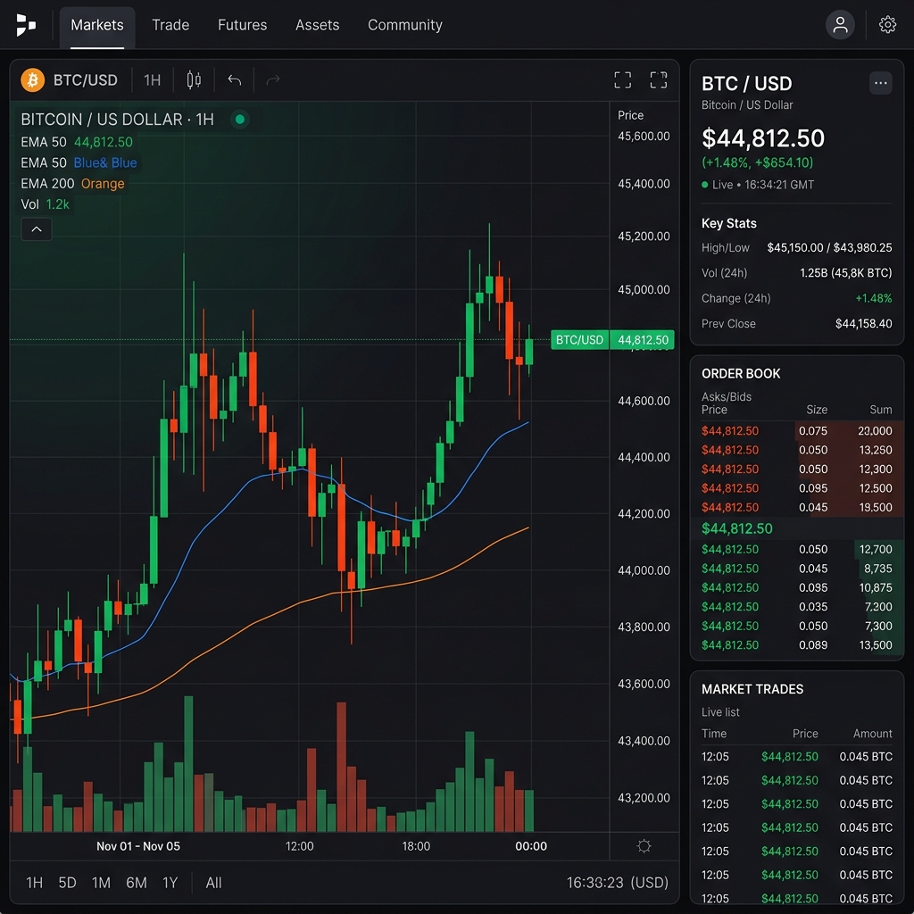
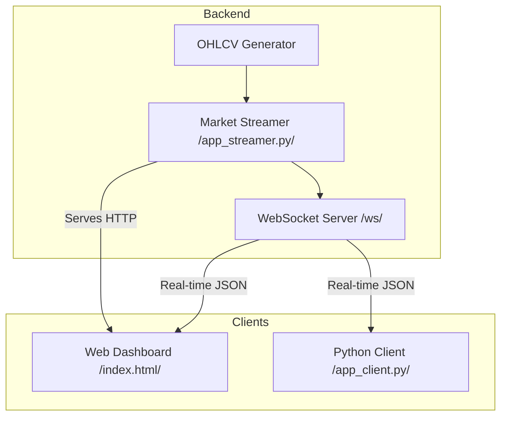

# 📈 Real-Time Market Data Simulator

A high-performance, real-time market data streaming ecosystem built with FastAPI and WebSockets. This project simulates financial market data (OHLCV candles) and provides multiple ways to consume and visualize it.



## 🚀 Overview

This repository contains a full-stack solution for market data simulation:
- **Market Streamer**: A FastAPI backend that generates synthetic OHLCV data for `GOLDM26` and broadcasts it via WebSockets.
- **Web Dashboard**: A premium, responsive frontend visualizing the stream using **TradingView Lightweight Charts**.
- **Python Client**: A lightweight script to demonstrate programmatic connection and data handling.

## 🏗️ System Architecture



## ✨ Key Features

- **Dynamic Data Generation**: Realistic OHLCV candle simulation with configurable volatility.
- **Low Latency**: Real-time broadcasting via WebSockets.
- **Premium UI**: Dark-mode dashboard with smooth animations and interactive charts.
- **Cross-Platform Clients**: Support for both browser-based and script-based consumers.
- **Health Monitoring**: Visual connection status indicators on the dashboard.

## 🛠️ Tech Stack

- **Backend**: Python, FastAPI, Uvicorn, Websockets.
- **Frontend**: HTML5, Vanilla CSS3 (Custom Design System), JavaScript (ES6+).
- **Visualization**: [TradingView Lightweight Charts](https://tradingview.github.io/lightweight-charts/).
- **Fonts**: Inter & Outfit (via Google Fonts).

## 📥 Setup & Installation

### 1. Clone the Repository
```bash
git clone https://github.com/shubham-agarwal-techculture/simulate-market-data.git
cd simulate-market-data
```

### 2. Create Virtual Environment
```bash
python -m venv .venv
source .venv/bin/scripts/activate  # Windows: .venv\Scripts\activate
```

### 3. Install Dependencies
```bash
pip install -r requirements.txt
```

## 🚦 How to Run

### 1. Start the Market Streamer
```bash
cd market_streamer
python app_streamer.py
```
The server will start at `http://localhost:8001`.

### 2. Access the Web Dashboard
Open your browser and navigate to:
`http://localhost:8001/`

### 3. Run the Python Client (Optional)
To see the raw data stream in your terminal:
```bash
cd client
python app_client.py
```

## 📝 Configuration

The simulation parameters can be adjusted in `market_streamer/app_streamer.py`:
- `symbol`: The trading pair symbol (default: `GOLDM26`).
- `market_state`: Initial price and state.
- `generate_ohlcv()`: Logic for price movement and candle generation.

---
Built with ❤️ for real-time data enthusiasts.
